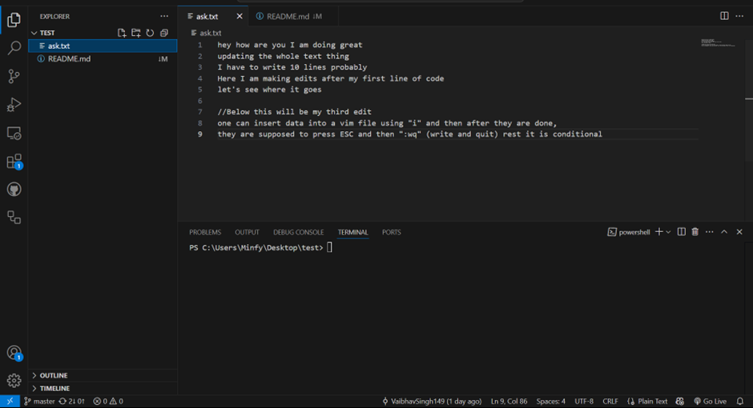
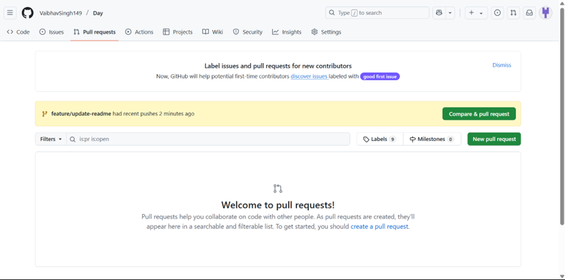

 Task-1 
Initialize a git repository, create a simple text file with 5-10 lines of code

2.Add the file to stage and make and initial commit
 

3. Make 3 separate meaningful changes to the file, committing each change with a proper commit message following conventional commits format

1st commit
First commit – Initialized a empty repo and updated the file with some txt

 
 
2nd commit 
Second commit – Added few lines of text and updated the file

3rd commits
Third Commit – Added a few more lines in which explained how to handle vim file

4. Use git log to view history of changes

 
Assignment-2
Created a github account, created a github repository

Task-
Pushed the Assignment-1 to Github
 

4. Create a Readme.md file directly on github using the web interface

5. Pull the changes to local repository

6. Create a new branch locally named “feature /update-readme”

7. Make changes to README.md and push the branch to github

8. Create a pull request from “feature/update-readme” to main branch
(used octopus pull)

 

9. Review and merge the pull request

Merged the request and pushed 

